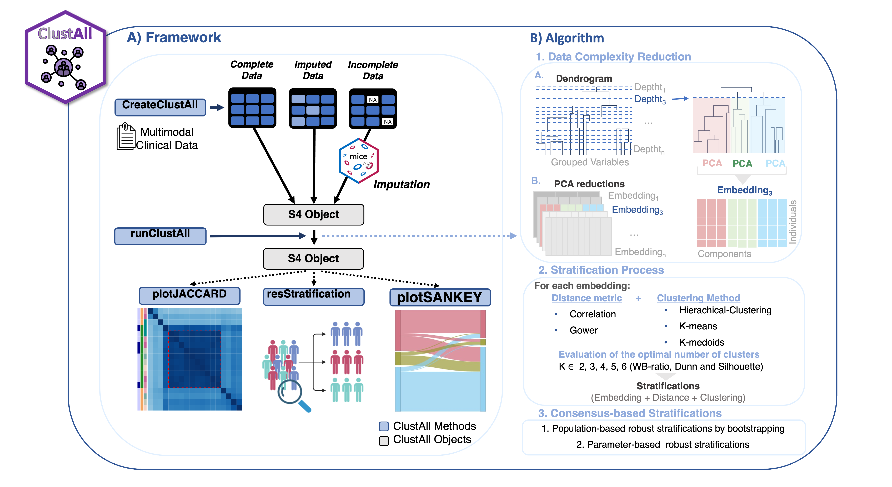

```{r, include = FALSE}
knitr::opts_chunk$set(
    collapse = TRUE,
    comment = "#>"
)
```

# Intro

ClustAll is an R package originally developed for patient stratification
in complex diseases.

ClustAll constitutes a stratification framework aim at identifying
patient subgroups while addressing the most common challenges found when
dealing with clinical data. The idea of this pipeline is that if a
stratification is solid, it should be possible to arrive at such
stratification through different clustering methods. To compute patient
stratification, ClustAll combines different distance metrics
(Correlation based-distance and Gower distance), as well as different
clustering methods (K-Means, K-Medoids and H-Clust).

Furthermore, ClustAll:\
- Allows to work with data with missing values, mixed data and
correlated variables.\
- Provides more than a single stratification solution, unlike other
packages.\
- It is population-based robust: ClustAll performs a population-based
robustness analysis for each candidate stratification using
bootstrapping. This analysis ensures that non-robust stratifications are
excluded.\
- It is parameter-based robust: The selection of representative
stratifications enables the preservation of those stratifications that
demonstrate parameter-based robustness: consistency when depth, distance
metrics or clustering methods are altered.

In addition, the package offers functions to:\
- Validate the output using the true labels. 
- Show the patient flow
between clusters if two candidate stratifications are compared.




# Setup

First, install the ClustAll package if is not already installed.

```{r setup}
library(ClustAll)
```

# Examples on how to use ClustAll on Public Data Sets.

## Breast Cancer Wisconsin (Diagnostic)

Input data for this example can be found on doi: 10.24432/C5DW2B

Features are computed from a digitized image of a fine needle aspirate
(FNA) of a breast mass. They describe characteristics of the cell nuclei
present in the image. From 569 patients.

This dataset contains **30 variables** (10x3), which consist of ten
real-valued features are computed for each cell nucleus:

```         
a) radius (mean of distances from center to points on the perimeter)
b) texture (standard deviation of gray-scale values)
c) perimeter
d) area
e) smoothness (local variation in radius lengths)
f) compactness (perimeter^2 / area - 1.0)
g) concavity (severity of concave portions of the contour)
h) concave points (number of concave portions of the contour)
i) symmetry 
j) fractal dimension ("coastline approximation" - 1)
```

In addition to the patient ID and the Diagnose (Diagnosis (M =
malignant, B = benign)).

### Loading and preparing data

```{r}
data("BreastCancerWisconsin", package = "ClustAll") # load example data
# remove patients ID, as it is not a clinical variable
data_use <- subset(wdbc,select=-ID)
str(data_use)
```

##### **createClustAll**

This function creates the class ClustAllObject. It is an S4 object
designed to apply the ClustAll algorithm and store the main results.\
<br> The usage and arguments are the following:\
*data_use* - Data Frame with the original dataset. It may contain
missing values (NAs).\
*nImputation* - Numeric value. Number of imputations to be computed in
case there original dataset contains NAs.\
*dataImputed* - mids object created with mice R package. The data used
to compute the imputation and the data_used using must be the same.

**There are 3 possible scenarios:**\
- The data **does not contain NAs**. nImputation & dataImputed are not
required\
- The data **contains NAs** and the **imputations are computed within
ClustAll** **framework** (using mice package). nImputations is
required.\
- The data **contains NAs** and the **imputed data set (mid class)** .
dataImputed is required.

### a) **Workflow with a dataset with no missing values**

##### **createClustAll**

```{r}
obj_noNA <- createClustAll(data = data_use, colValidation = "Diagnosis",
                            nImputation = NULL, dataImputed = NULL)
```

<br>

##### **runClustAll method**

This function computes the ClustAll algorithm.\
<br> The usage and arguments are the following:\
*Object* - ClustAllObject-class object. *threads* - Numeric value.
Number of cores to use (for parallel computing).\
*simplify* - Logical value. If TRUE only 1 out of 4 depths of the
dendrogram are considered; if FALSE all possible depths of the
dendrogram are considered.

```{r, results=FALSE}
obj_noNA1 <- runClustAll(Object = obj_noNA, threads = 8, simplify = FALSE)
obj_noNA1simplify <- runClustAll(Object = obj_noNA, threads = 8,
                                simplify = TRUE)

tNOsimplify <- system.time(runClustAll(Object = obj_noNA, threads = 8,
                                        simplify = FALSE))
tYESsimplify <- system.time(runClustAll(Object = obj_noNA, threads = 8, 
                                        simplify = TRUE))
```

```{r}
print(tNOsimplify)
print(tYESsimplify)
```

Once the ClustAll algorithm is executed, ClustAll output can be
explored.

<br>

##### **plotJACCARD**

This function plots the correlation matrix heatmap showing the Jaccard
Distance between robust stratifications. <br> The usage and arguments
are the following:\
*Object* - ClustAllObject-class object. *paint* - Logical value. If
TRUE, group of similar stratifications are highlighted within a red
square. *stratification_similarity* - Numeric value. The minimum Jaccard
Distance value to consider a of pair stratifications similar. Default is
0.7.

```{r, results=FALSE, warning=FALSE}
plotJACCARD(Object = obj_noNA1, stratification_similarity =  0.7)
plotJACCARD(Object = obj_noNA1, stratification_similarity = 0.6)
plotJACCARD(Object = obj_noNA1, stratification_similarity = 0.9)
plotJACCARD(Object = obj_noNA1, stratification_similarity = 0.88)
plotJACCARD(Object = obj_noNA1simplify, stratification_similarity = 0.88)
```

<br>

##### **resStratification**

This function returns the stratification representatives by filtering
those stratifications that does not contain clusters with a minimum
percentage of the population. It can return all the robust
stratifications or just one representative each group of robust
stratifications.\
<br> The usage and arguments are the following:\
*Object* - ClustAllObject-class object. *population* - Numeric value.
Minimum percentage of the total population that a cluster in a
stratification must have to be considered as representative. Default is
0.05 (5%). *stratification_similarity* - Numerical value. The minimum
Jaccard Distance value to consider a pair of stratifications similar.
Default is 0.7.\
*all* - Logical value. If TRUE, it returns all the similar
representative stratifications. If FALSE, only the centroid
stratification for each group of similar stratifications is returned.

```{r}
resStratification(Object = obj_noNA1, population = 0.05, 
                    stratification_similarity = 0.88, all = FALSE)
```

<br>

##### **plotSANKEY**

This function plots the Sankey diagram of two selected clusters in order
to compare them. <br> The usage and arguments are the following:\
*Object* - ClustAllObject-class object. *clusters* - Character vector
with the names of a pair of stratifications. Check resStratification to
obtain all the stratification names.

```{r}
plotSANKEY(Object = obj_noNA1, clusters = c("cuts_c_3","cuts_a_9"), 
            validationData = FALSE)
plotSANKEY(Object = obj_noNA1, clusters = c("cuts_c_3","cuts_b_13"), 
            validationData = FALSE)
plotSANKEY(Object = obj_noNA1, clusters = "cuts_c_3", validationData = TRUE)
plotSANKEY(Object = obj_noNA1, clusters = "cuts_b_13", validationData = TRUE)
```

<br>

##### **cluster2data**

This function returns a dataframe with the original dataset together
with the selected ClustAll stratification(s) included as variables.\
<br> The usage and arguments are the following:\
*Object* - ClustAllObject-class object. *clusterName* - Character vector
with one or more stratification names.

```{r}
df <- cluster2data(Object = obj_noNA1, 
                    clusterName = c("cuts_c_3","cuts_a_9","cuts_b_13"))
```

<br>

##### **Validation**

This function aims to validate the results obtained with the (multiple)
robust stratification(s) with the original data labelling if it was
present in the original dataset.

```{r}
# STRATIFICATION 1
validateStratification(obj_noNA1, "cuts_a_9")
```

```{r}
# STRATIFICATION 2
validateStratification(obj_noNA1, "cuts_b_13")
```

```{r}
# STRATIFICATION 3
validateStratification(obj_noNA1, "cuts_c_3")
```

### b) **Workflow with a dataset with missing values and imputation performed within ClustAll framework**

The same procedure where the dataset contains missing values. 

##### **createClustAll and perform imputation**

```{r}
data("BreastCancerWisconsinMISSING", package = "ClustAll")
data_use_NA <- wdbcNA
colSums(is.na(data_use_NA)) # dataset present NAs

obj_NA <- createClustAll(data_use_NA, nImputation = 5,  
                            colValidation = "Diagnosis") 

# The rest of the pipeline follows as a)
```

##### **runClustAll method**

```{r, results=FALSE}
obj_NA1 <- runClustAll(obj_NA, threads = 8) 
```

##### **plotJACCARD**

```{r, results=FALSE, warning=FALSE}
plotJACCARD(Object = obj_NA1, stratification_similarity = 0.9)
```

##### **resStratification**

```{r}
resStratification(Object = obj_NA1, population = 0.05, 
                    stratification_similarity = 0.88, all = FALSE)
```

##### **cluster2data**

```{r}
df_NA <- cluster2data(Object = obj_NA1, clusterName = c("cuts_a_4"))
```

### c) **Workflow with a dataset with missing values and imputation performed out of ClustAll framework**

The same procedure where the dataset has been previously imputed.

##### Perform imputation and store in an mids object. In this case, mice package is used.

```{r}
library(mice)
data("BreastCancerWisconsinMISSING", package = "ClustAll") # load example data
data_use_NA <- wdbcNA
str(data_use_NA)

imp_data_use <- mice(data_use_NA[-1], m=5, maxit = 5,seed=1234, print=FALSE)
```

##### **createClustAll object**

```{r}
# dataImputed contains the mids object with the imputed
obj_imp <- createClustAll(data=data_use_NA, dataImputed = imp_data_use, 
                            colValidation = "Diagnosis") 

# The rest of the pipeline follows as a)
```

##### **runClustAll method**

```{r, results=FALSE}
obj_imp1 <- runClustAll(obj_imp, threads = 8)
```

##### **plotJACCARD**

```{r, results=FALSE, warning=FALSE}
plotJACCARD(Object = obj_imp1, stratification_similarity = 0.9)
```

##### **resStratification**

```{r}
resStratification(Object = obj_imp1, population = 0.05, 
                    stratification_similarity = 0.9, all = FALSE)
```

##### **cluster2data**

```{r}
df_imp <- cluster2data(Object = obj_NA1, 
                        clusterName = c("cuts_a_1", "cuts_a_16"))

validateStratification(obj_noNA1, "cuts_a_1")
validateStratification(obj_noNA1, "cuts_a_16")
```

Session Info

```{r}
sessionInfo()
```
