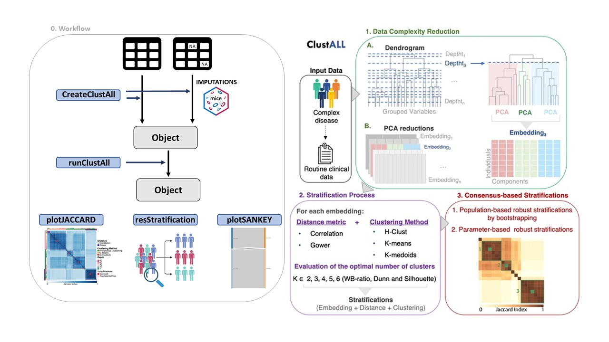

```{r, include = FALSE}
BiocStyle::markdown()
knitr::opts_chunk$set(
  collapse = TRUE,
  comment = "#>"
)
```

# 0. Introduction

ClustAll is an R package designed for patient stratification in complex diseases. It addresses common challenges encountered in clinical data analysis and provides a versatile framework for identifying patient subgroups.

Patient stratification is essential in biomedical research for understanding disease heterogeneity, identifying prognostic factors, and guiding personalized treatment strategies. The ClustAll underlying concept is that a robust stratification should be reproducible through various clustering methods. ClustAll employs diverse distance metrics (Correlation-based distance and Gower distance) and clustering methods (K-Means, K-Medoids, and H-Clust).

### ClustAll key features:

-   **Handles Diverse Data Types**, including missing values, mixed data, and correlated variables.
-   **Provides Multiple Stratification Solutions**, enabling exploration of different clustering algorithms and parameters.
-   **Robustness Analysis**, to identify stable and reproducible clusters.
-   **Validation** , for assessing the reliability of clustering results using clinical phenotypes (true labels) if available.
-   **Visualization** functions for interpreting clustering results and comparing different stratifications.

### Interpreting ClustAll Stratification Output

The names of ClustAll stratification outputs consist of a letter followed by a number, such as *cuts_a_9*. The letter denotes the combination of distance metric and clustering method utilized to generate the particular stratification, while the number corresponds to the embedding derived from the depth at which the dendrogram with grouped variables was cut.

```{r}
table <- data.frame(Nomenclature=c("a","b","c","d"), 
                    `Distance Metric`=rep(c("Correlation", "Gower"), each=2), 
                    `Clustering Method`=c("K-means", "Hierarchical Clustering", 
                                          "K-medoids", "Hierarchical-Clustering"))
knitr::kable(table, align = c("l", "l", "l"))
```



# 1. Installation

ClustAll is developed using S4 object-oriented programming, and requires R (\>=4.2.0). ClustAll utilizes other R packages that are currently available from CRAN and Bioconductor.

```{r installation, eval=FALSE}
if (!require("devtools", quietly = TRUE))
    install.packages("devtools")
devtools::install_github("TranslationalBioinformaticsUnit/ClustAll")
```

After installation, load the ClustAll package:

```{r load}
library(ClustAll)
```

# 2. ClustAll Application Example

**Breast Cancer Wisconsin (Diagnostic)** ClustAll includes a real dataset of breast cancer ([doi: 10.24432/C5DW2B](https://doi.org/10.24432/C5DW2B)). This dataset comprises two types of features ---categorical and numerical--- derived from a digitized image of a fine needle aspirate (FNA) of a breast mass from 659 patients. Each patient is characterized by 30 features (10x3) and belongs to one of two target classes: 'malignant' or 'benign'. To showcase ClustAll's when dealing with missing data, a modification with random missing values was applied to the dataset, demonstrating the package's resilience in handling missing data. The breast cancer dataset includes the following features:

  a)  **radius:** Mean of distances from the center to points on the perimeter.
  b)  **texture:** Standard deviation of gray-scale values.
  c)  **perimeter**
  d)  **area**
  e)  **smoothness:** Local variation in radius lengths.
  f)  **compactness:** (Perimeter\^2 / Area) - 1.0.
  g)  **concavity:** Severity of concave portions of the contour.
  h)  **concave points:** Number of concave portions of the contour.
  i)  **symmetry**
  j)  **fractal dimension:** "Coastline approximation" - 1.

The dataset also includes the patient ID and diagnosis (M = malignant, B = benign).

## 2.1 Get data from example

We load the breast cancer dataset. An initial exploration reveals the absence of missing values. The dataset comprises 30 numerical features and one categorical feature. As the initial data does not contain missing values we will apply the ClustAll workflow accordingly.

```{r}
# load example data
data("BreastCancerWisconsin", package = "ClustAll") 
# remove patients IDs (non-informative)
data_use <- subset(wdbc, select=-ID)
# check the presence of missing values
sum(is.na(data_use))
```

## 2.2 Create the ClustAll object

First, the ClustAllObject object is created and stored. In this step, we indicate that "Diagnosis" is the feature that contains the true labels in the argument `colValidation`.

```{r}
obj_noNA <- createClustAll(data = data_use, nImputation = NULL, 
                           dataImputed = NULL, colValidation = "Diagnosis")
```

## 2.3 Execute the ClustAll algorithm

Next, we apply the ClustAll algorithm. The output is stored in a ClustAllObject, which contains the clustering results.

```{r, results=FALSE}
obj_noNA1 <- runClustAll(Object = obj_noNA, threads = 2, simplify = FALSE)
```

Have a look to the object.

```{r}
obj_noNA1
```

## 2.4 Represent the Jaccard Distance between population-robust stratifications

The heatmap below presents a correlation matrix depicting the similarity between population-robust stratifications (\>85% bootstrapping stability). Additionally, discontinuous red rectangles highlight alternative stratifications solutions based on those stratifications that exhibit a level of similarity (0-1) specified in the `stratification_similarity` argument. The heatmap row annotation describes the combination of parameters ---distance metric, clustering method, and embedding number--- from which each stratification is derived. In this specific case, a similarity of 0.88 reveals three different groups of alternatives for stratifying the population, indicated by the the red rectangles.

```{r, results=FALSE, warning=FALSE}
plotJACCARD(Object = obj_noNA1, stratification_similarity = 0.88)
```

## 2.5 Retrieve stratification representatives

The centroids (a representative) from each groupo of alternative stratification solutions (highlighted in red squares in the previous step) are displayed. Each representative stratification illustrates the number of clusters and the patients belonging to each cluster. In this case, the alternative stratifications have been computed with the following specifications: - cuts_a_9: This stratification was generated using Embedding 9 with the correlation distance metric and the kmeans clustering algorithm. It consists of two clusters, with 193 and 376 patients, respectively. - cuts_c_3: This stratification was generated using Embedding 3 with the gower distance metric and the kmedoids clustering algorithm. It consists of two clusters, with 199 and 370 patients, respectively. - cuts_b_9: This stratification was generated using Embedding 9 with the correlation distance metric and the hierarchical clustering algorithm. It consists of two clusters, with 199 and 370 patients, respectively.

```{r}
resStratification(Object = obj_noNA1, population = 0.05, 
                  stratification_similarity = 0.88, all = FALSE)
```

## 2.6 Generate Sankey diagrams comparing pairs of stratifications, or a stratification with true labels

The first Sankey plot illustrates patient transitions between two sets of representative stratifications (cuts_c_3 and cuts_a_9), revealing the flow and distribution of patients across the clusters. The second Sankey plot illustrates patient transitions between a representative stratifications (cuts_a_9) and the true labels, revealing the flow and distribution of patients across the clusters.

```{r}
plotSANKEY(Object = obj_noNA1, clusters = c("cuts_c_3","cuts_a_9"), 
           validationData = FALSE)

plotSANKEY(Object = obj_noNA1, clusters = c("cuts_a_9"), 
           validationData = TRUE)
```

## 2.7 Retrieve the original dataset with the selected ClustAll stratification(s)

The three stratification representatives are added to the initial dataset to facilitate further exploration.

```{r}
df <- cluster2data(Object = obj_noNA1,
                   stratificationName = c("cuts_c_3","cuts_a_9","cuts_b_9"))
```

## 2.8 Assess the results the sensitivity and specifity of the selected ClustAll stratifications against true labels (if available)

To evaluate the performance of the selected ClustAll stratifications against true labels, sensitivity and specificity are assessed. Higher values indicate greater precision in the stratification process. In this particular case, all three stratification representatives exhibit a sensitivity and specificity exceeding 80% and 90%, respectively, despite being computed using different methods. These results underscore the notion that a robust stratification should be consistent across diverse clustering methods.

```{r}
# STRATIFICATION 1
validateStratification(obj_noNA1, "cuts_a_9")
# STRATIFICATION 2
validateStratification(obj_noNA1, "cuts_b_13")
# STRATIFICATION 3
validateStratification(obj_noNA1, "cuts_b_9")
```

Session Info

```{r}
sessionInfo()
```
